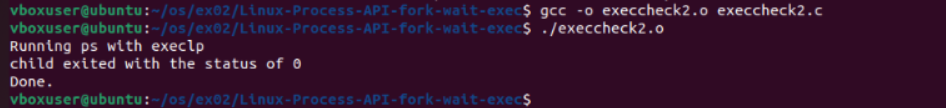

# Linux-Process-API-fork-wait-exec-
Ex02-Linux Process API-fork(), wait(), exec()
# Ex02-OS-Linux-Process API - fork(), wait(), exec()
Operating systems Lab exercise

# AIM:
To write C Program that uses Linux Process API - fork(), wait(), exec()

# DESIGN STEPS:

### Step 1:

Navigate to any Linux environment installed on the system or installed inside a virtual environment like virtual box/vmware or online linux JSLinux (https://bellard.org/jslinux/vm.html?url=alpine-x86.cfg&mem=192) or docker.

### Step 2:

Write the C Program using Linux Process API - fork(), wait(), exec()

### Step 3:

Test the C Program for the desired output. 

# PROGRAM:

## C Program to create new process using Linux API system calls fork() and getpid() , getppid() and to print process ID and parent Process ID using Linux API system calls
#include <stdio.h>
#include <unistd.h>
#include <stdlib.h>

int main() {
    int pid;

    pid = fork();   // create new process

    if (pid < 0) {
        // fork failed
        printf("Fork failed\n");
        exit(1);
    }
    else if (pid == 0) {
        // child process
        printf("I am Child Process\n");
        printf("Child PID is: %d\n", getpid());
        printf("Parent PID is: %d\n", getppid());
    }
    else {
        // parent process
        printf("I am Parent Process\n");
        printf("Parent PID is: %d\n", getpid());
        printf("Child PID is: %d\n", pid);
    }

    return 0;
}

##OUTPUT

## C Program to execute Linux system commands using Linux API system calls exec() , exit() , wait() family

#include <stdio.h>
#include<stdlib.h>
int main(){
   int pid; 
   pid=fork(); 
   if(pid == 0) {
        printf("Iam child my pid is %d\n",getpid());   
        printf("My parent pid is:%d\n",getppid()); 
        exit(0);
 } 
   else{ 
        printf("I am parent, my pid is %d\n",getpid()); 
        sleep(100); 
        exit(0);
} 

##OUTPUT

# RESULT:
The programs are executed successfully.
